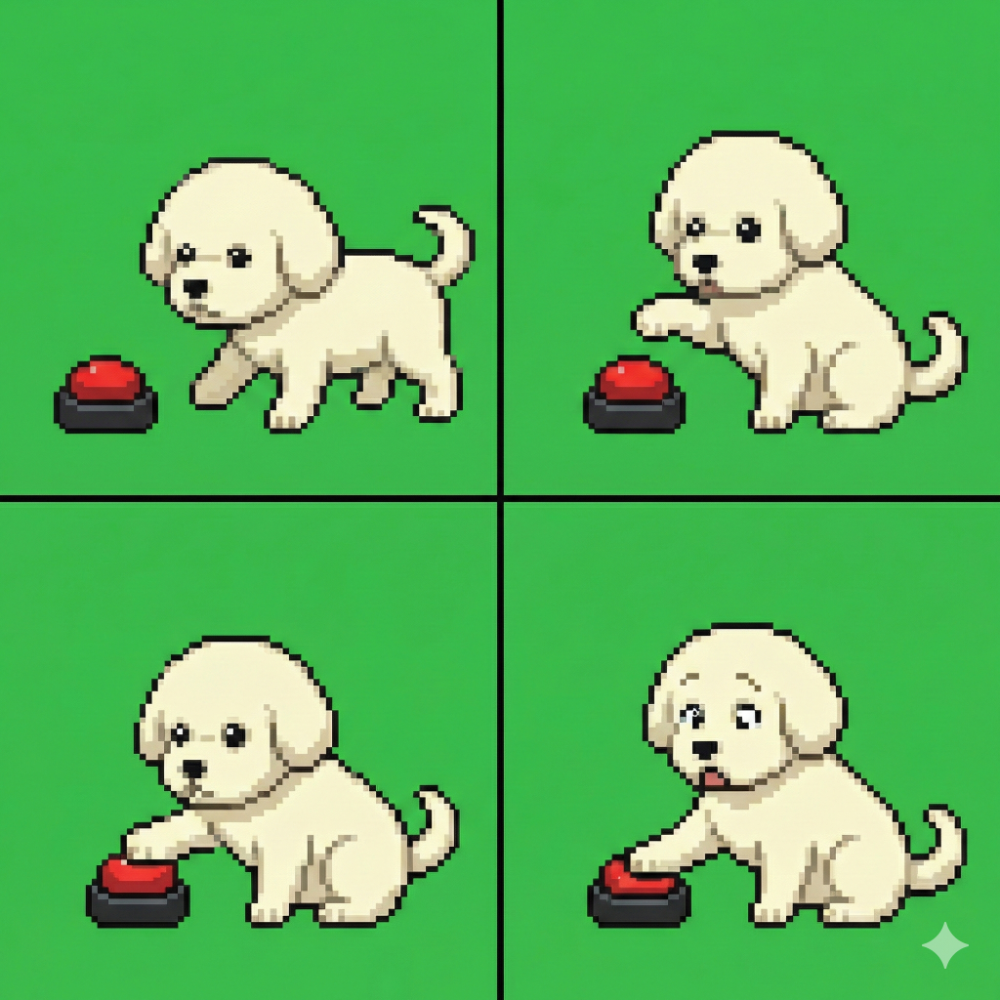
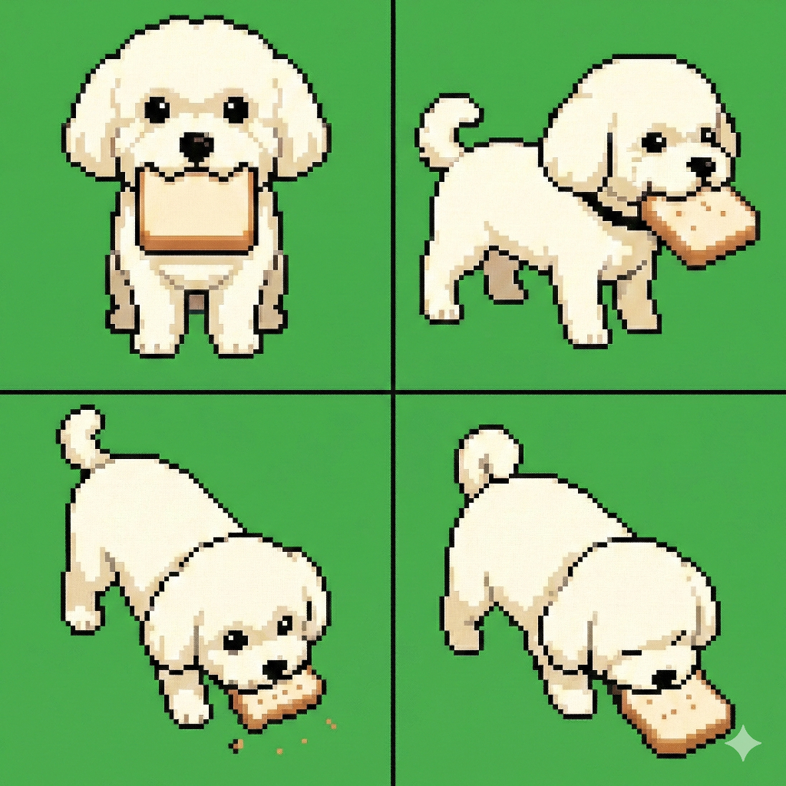

# Pixel Art Alignment Tool

A web-based tool for aligning and extracting pixel art from images. Drop an image, adjust the grid to match the pixel boundaries, and export clean pixel art.

## Features

- Drag-and-drop image loading
- Resizable grid overlay with corner and edge handles
- Adjustable N x M grid dimensions
- Grid opacity control (0%, 50%, 100%)
- Color sampling modes: center, mean, median
- Expand mode: add/remove cells while keeping cell size fixed
- Chroma key: remove background colors with tolerance slider and eyedropper
- Undo/redo support
- Keyboard shortcuts
- State persistence via localStorage
- Export to PNG at 1 pixel per cell

## Keyboard Shortcuts

- `1` / `2` / `3` - Grid opacity 0% / 50% / 100%
- `S` - Save PNG
- `X` - Toggle expand mode
- `E` - Eyedropper (pick chroma color from image)
- `C` - Toggle chroma key
- `Ctrl+Z` - Undo
- `Ctrl+Y` - Redo
- `Shift` - 10x precision when dragging
- `Ctrl` - Axis snap when dragging

## Gallery

| | | | |
|:---:|:---:|:---:|:---:|
|  |  |  |  |
| .png) |  |  |  |
|  |  |  |  |
|  |  |  | |

## Usage

Open `index.html` in a browser and drop an image onto the canvas.
